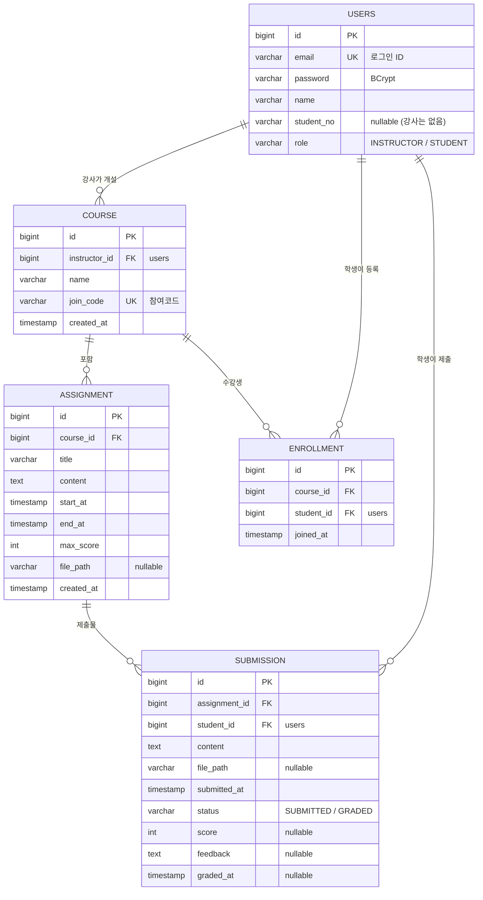

# ERD (초안)

관계와 필수 컬럼은 고정이며, 컬럼을 추가하면 이유를 이 문서와 README에 기록합니다.

## 제약 조건

| 테이블 | 제약 | 목적 |
|--------|------|------|
| users | UNIQUE(email) | 로그인 ID 중복 방지 |
| course | UNIQUE(join_code) | 참여코드로 강좌를 하나만 찾도록 |
| enrollment | UNIQUE(course_id, student_id) | 같은 강좌 중복 등록 방지 |
| submission | UNIQUE(assignment_id, student_id) | 과제당 학생 1건 (B3) |

`users`는 PostgreSQL 예약어 `user`와 충돌하지 않도록 복수형 테이블명을 씁니다.

## 관계 요약
- users(강사) 1 : N course, course 1 : N assignment
- course N : M users(학생) — enrollment 중간 테이블
- assignment 1 : N submission, users(학생) 1 : N submission

## 규칙과 데이터의 연결

| 규칙 | 데이터에서 확인하는 방법 |
|------|--------------------------|
| B1 | `assignment.start_at ≤ now ≤ end_at` |
| B2 | `enrollment`에 (course_id, student_id) 행이 있는지 |
| B3 | `submission`에 (assignment_id, student_id) 행이 있으면 UPDATE |
| B4 | `submission.status = 'GRADED'` |
| B5 | `course.instructor_id = 로그인한 강사 id` |
| B6 | `0 ≤ score ≤ assignment.max_score` |
| B7 | `assignment.end_at > start_at` |
| B8 | `submission`에 해당 assignment_id 행이 있는지 |

## 추가 컬럼 후보

아래는 제공된 ERD에 없는 후보이며 **아직 확정하지 않았습니다.** 확정하면 이유를 적고 README에 반영합니다.

| 후보 | 이유 | 필요성 |
|------|------|--------|
| assignment.original_filename, submission.original_filename | 저장명은 UUID이므로 다운로드 시 원래 파일명을 보여 주기 위해 | 파일 첨부를 구현하면 필요 |
| users.created_at | 가입일 기록 | 낮음 |
| course.description | 강좌 설명 표시 | 낮음 |
