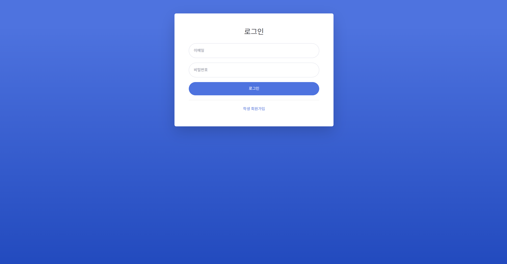
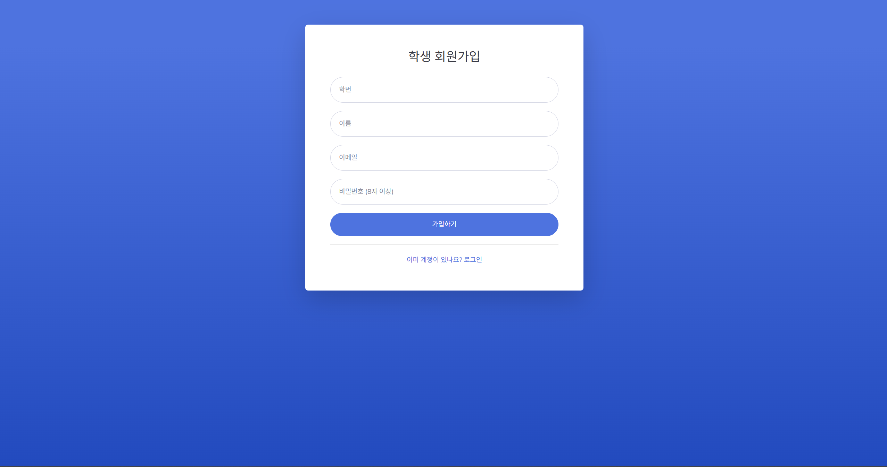
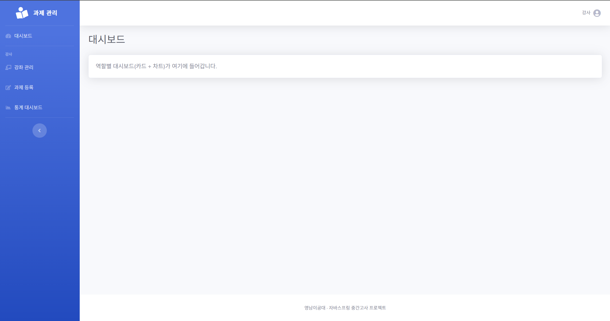

# 📋 W1 진행 보고 — 설계 + 기반

> 설계 문서와 엔티티, 화면 레이아웃을 만들고 공통 기능 **U1~U4**를 구현했습니다.
> 전체 테스트 **41개가 통과**하며, 앱을 직접 띄워서 가입 · 로그인 · 역할별 화면 · 403 처리를 확인했습니다.

## 1. 체크포인트

| ID | 기능 | 상태 | 확인 방법 |
|:--:|------|:----:|-----------|
| U1 | 학생 회원가입 | ✅ 완료 | 테스트 통과, 가입 후 DB에 BCrypt · STUDENT 저장 확인, role 위조 요청 무시 |
| U2 | 로그인 · 로그아웃 | ✅ 완료 | 테스트 통과, 강사/학생 로그인, 틀린 비밀번호 처리, 대소문자 다른 이메일 로그인 |
| U3 | 역할별 메뉴 | ✅ 완료 | 사이드바 분리 확인, `/instructor/**` · `/student/**` 교차 접근 403 확인 |
| U4 | 강사 초기 계정 | ✅ 완료 | `.env`(INSTRUCTOR_*)로 생성, 중복 생성 안 됨, 비밀번호가 없으면 생성 안 됨 |

## 2. 화면

### 로그인 (U2)

### 학생 회원가입 (U1)

### 강사 로그인 후 메인 (U2 · U3 · U4)
강사 계정으로 로그인한 화면입니다. 사이드바에 **강사 메뉴**(강좌 관리, 과제 등록, 통계 대시보드)만 보이고, 우측 상단에 `.env`에 설정한 강사 이름이 표시됩니다.

> [!NOTE]
> 처음에는 `.env`의 한글 이름이 깨져서 표시되었습니다([#6](https://github.com/daengsuk2/college_subject_site/issues/6)). 수정 후 정상으로 표시되는 것을 확인하고 이 캡처로 교체했습니다.

## 3. 작업 내용

| PR | 내용 |
|:--:|------|
| [#1](https://github.com/daengsuk2/college_subject_site/pull/1) | 엔티티 5개와 리포지토리 (UNIQUE 제약 포함) |
| [#2](https://github.com/daengsuk2/college_subject_site/pull/2) | U1 회원가입, 공통 예외 처리, 패키지 구조 정리 |
| [#3](https://github.com/daengsuk2/college_subject_site/pull/3) | U2 로그인 · U4 강사 초기 계정 |
| [#4](https://github.com/daengsuk2/college_subject_site/pull/4) | U3 역할별 URL 접근 제한 |

## 4. 이슈와 해결

| 이슈 | 원인 | 조치 | 상태 |
|------|------|------|:----:|
| 로그인하지 않은 사용자에게 403 화면이 그려지지 않음 | 상단바가 로그인 정보를 읽다가 비로그인 상태에서 실패 | 로그인 여부에 따라 표시하도록 수정, 수정 전에는 실패하는 회귀 테스트 추가 | ✅ 해결 |
| 기능 상태를 "완료"로 잘못 기록 (U3) | 코드만 작성하고 검증 전에 기록 | 검증 후 정정 (URL 제한까지 확인하고 완료 처리) | ✅ 해결 |
| [#6](https://github.com/daengsuk2/college_subject_site/issues/6) `.env`의 한글 이름이 화면에서 깨짐 | `.env[.properties]`로 읽으면 ISO-8859-1로 해석되어 UTF-8 한글이 잘못 디코딩되고, DB에 잘못된 값이 저장됨 | `.env`를 UTF-8로 직접 읽는 로더 추가, 단위 테스트 6개 추가, 깨진 강사 계정을 삭제 후 재생성해 `.env`의 이름과 DB 값이 일치함을 확인 | ✅ 해결 |

## 5. 결정 사항

| 항목 | 결정 | 이유 |
|------|------|------|
| DB | PostgreSQL (Docker) | H2 사용 금지 조건, 설치 없이 재현 가능 |
| Java | 21 | 팀 프로젝트와 동일, 툴체인으로 고정 |
| 패키지 | `global` + 기능별 (controller / domain / dto / exception / repository / service) | 기능 ID와 코드 위치를 대응시키기 위해 |
| 테스트 | `@SpringBootTest` + 별도 `midterm_test` DB | 개발 데이터와 분리 |
| 이메일 | 공백 제거 + 소문자로 저장 · 조회 | 대소문자만 다른 중복 가입 방지 |
| 학번 | 중복 허용 (ERD에 UNIQUE 없음) | 제공된 ERD를 따름 |
| 비밀번호 | 8자 이상 | 최소 길이 검증 |

## 6. 확인하지 못한 것 · 이월

- 학생 로그인 화면, 403 화면, 테스트 통과 화면의 캡처 (추후 추가)
- 미정 결정 4개 (참여코드 형식, 첨부파일 저장, 상태 배지, 추가 컬럼)는 W2~W3에서 확정
- 프롬프트 로그 제출 형식은 강사님께 확인 필요

## 7. AI 사용 기록

Claude Code로 설계 초안 · 구현 · 테스트를 진행했고, 결정 사항은 직접 확인하고 선택했습니다.

## 8. 다음 주 (W2) 계획

| ID | 내용 |
|:--:|------|
| I1 | 강좌 개설 + 참여코드 자동 발급 |
| I2 | 수강생 목록 |
| I3 | 과제 등록 · 수정 · 삭제 + 기간 설정 |
| S1 | 참여코드로 수강 등록 |
| S2 | 내 과제 목록 (예정 · 진행중 · 마감 배지) |

> 필수 기능 이후 진행할 선택 기능은 [아이디어 · 추가 예정](ideas.md)에 정리해 두었습니다.
