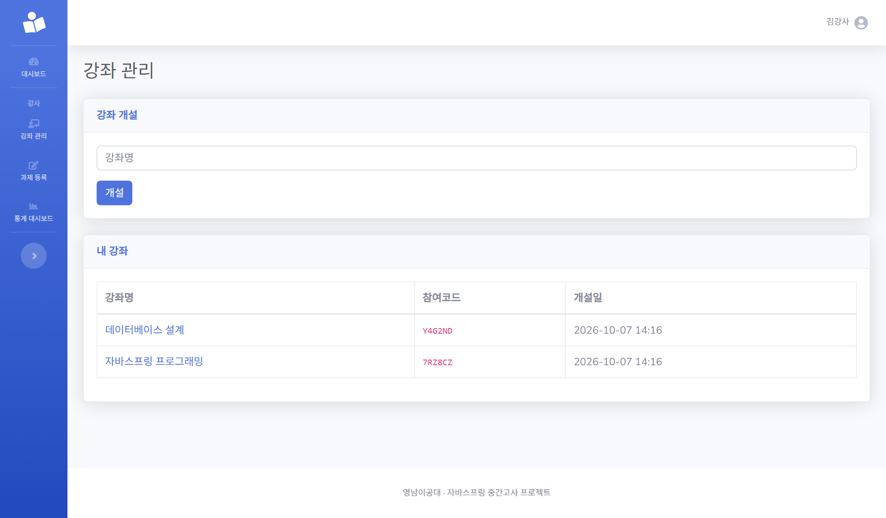
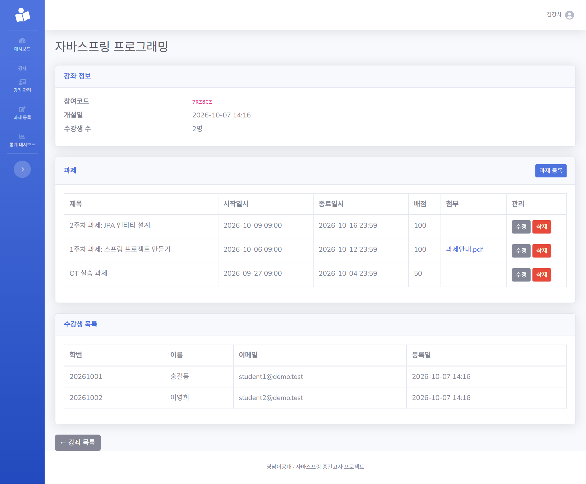
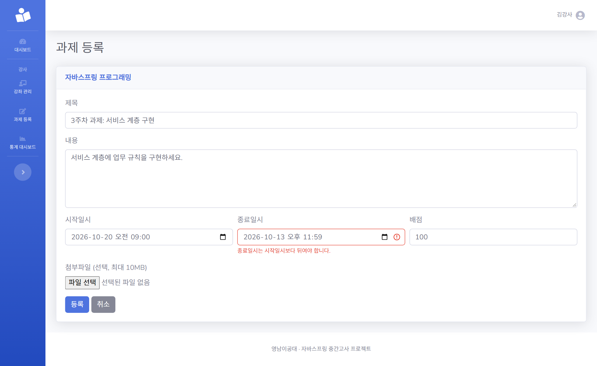
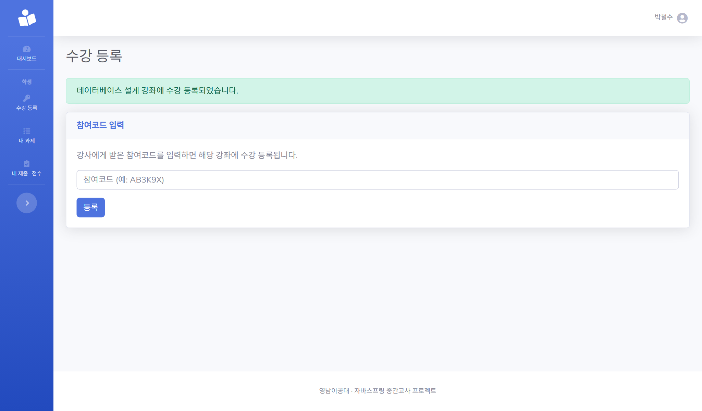
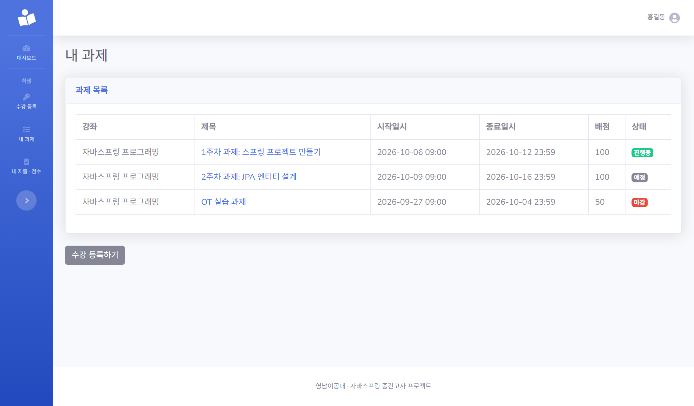
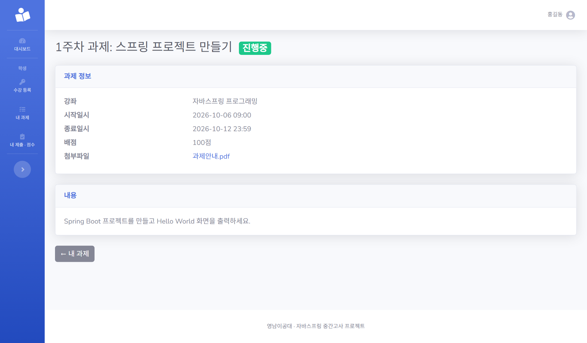
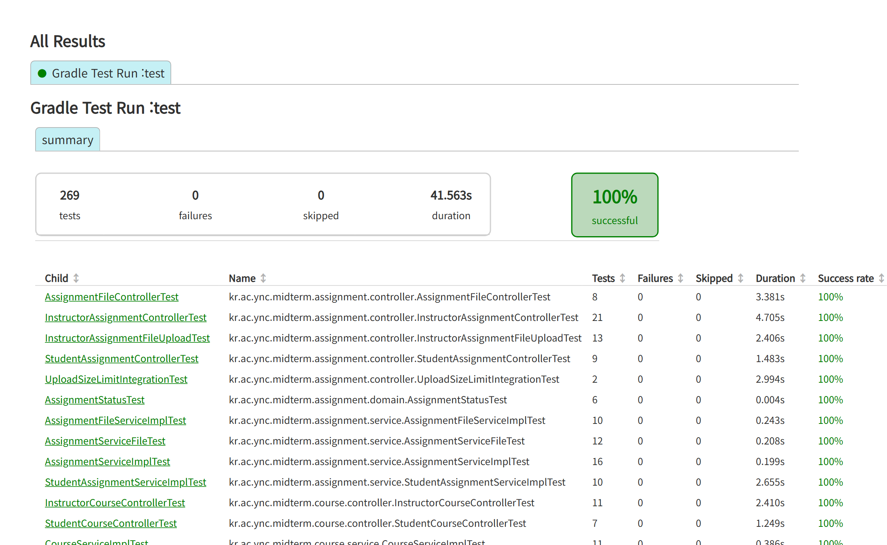

# 📋 W2 진행 보고 — 강좌 · 과제 등록

> 강좌 개설부터 수강 등록, 수강생 목록, 과제 등록 · 수정 · 삭제(첨부파일 포함), 학생의 내 과제 목록까지 **W2 범위(I1~I3, S1~S2)를 모두 구현**했습니다.
> 전체 테스트 **269개가 통과**하며, 규칙(B2 · B5 · B7 · B8)과 파일 업로드 방어는 **일부러 약하게 만들었을 때 테스트가 실패하는지**까지 확인했습니다.

## 1. 체크포인트

| ID | 기능 | 상태 | 확인 방법 |
|:--:|------|:----:|-----------|
| I1 | 강좌 개설 + 참여코드 자동 발급 | ✅ 완료 | 6자리 참여코드 발급, 본인 강좌만 조회(B5), 빈 강좌명 에러, 학생 접근 403. 화면 · DB · 테스트 확인 ([#10](https://github.com/daengsuk2/college_subject_site/pull/10)) |
| S1 | 참여코드로 수강 등록 | ✅ 완료 | 소문자 · 공백 입력 허용, 중복 등록 안내, 없는 코드 · 빈 값 에러, 강사 403. 화면 · DB · 테스트 확인 ([#12](https://github.com/daengsuk2/college_subject_site/pull/12)) |
| I2 | 수강생 목록 | ✅ 완료 | 등록 순서대로 표시, 수강생 없는 강좌 안내, 없는 강좌 404, 학생 403. 다른 강사의 강좌 403(B5)은 테스트로 확인 ([#14](https://github.com/daengsuk2/college_subject_site/pull/14)) |
| I3 | 과제 등록 · 수정 · 삭제 | ✅ 완료 | 필수값 · 종료일시(B7) 에러, 수정 폼에 기존 값, 삭제 확인 창. B8은 제출 기능 전이라 테스트로 확인 ([#19](https://github.com/daengsuk2/college_subject_site/pull/19)) |
| I3-b | 과제 첨부파일 업로드 · 다운로드 | ✅ 완료 | 한글 파일명 다운로드, 허용하지 않는 형식 거부, 10MB 초과 안내, 수정 시 교체 · 삭제 시 파일 정리, 미수강 학생 403 ([#23](https://github.com/daengsuk2/college_subject_site/pull/23)) |
| S2 | 내 과제 목록 + 상태 배지 | ✅ 완료 | 예정 · 진행중 · 마감 배지와 정렬, 상세, 미수강 강좌 과제 403(B2), 경계값은 시각을 고정한 테스트로 확인 ([#21](https://github.com/daengsuk2/college_subject_site/pull/21)) |

## 2. 적용한 규칙

| 규칙 | 내용 | 적용 위치 | 확인 |
|:----:|------|-----------|------|
| B2 | 수강 등록된 학생만 과제 열람 · 첨부 다운로드 | 내 과제 목록 · 상세, 첨부 다운로드 | 테스트 · 규칙 제거 시 실패 확인 |
| B5 | 강사는 본인 강좌의 강좌 상세 · 과제 · 첨부만 | 강좌 상세, 과제 등록 · 수정 · 삭제, 첨부 | 테스트 · 규칙 제거 시 실패 확인 |
| B7 | 종료일시는 시작일시보다 뒤 | 과제 등록 · 수정 (서비스에서 검사) | 화면 + 테스트 · 규칙 제거 시 5개 실패 |
| B8 | 제출이 있는 과제는 삭제 불가 | 과제 삭제 | 제출 기능(W3) 전이라 테스트로만 확인, 규칙 제거 시 2개 실패 |

## 3. 화면

> 아래 캡처는 **시연용 가짜 데이터**(가짜 이름 · 학번 · 이메일)로 촬영했습니다.

### 강좌 개설과 참여코드 (I1)

### 강좌 상세: 과제 목록 · 첨부 · 수강생 목록 (I2 · I3)
과제 표에서 첨부파일(`과제안내.pdf`)은 원본 이름으로 표시되고, 아래에 수강 등록한 학생이 등록 순서대로 나옵니다.

### 과제 등록: 종료일시 검증 (B7)
종료일시를 시작일시보다 이르게 입력하면 종료일시 칸에 안내가 나오고 입력값은 유지되며, 저장되지 않습니다.

### 학생: 참여코드로 수강 등록 (S1)

### 학생: 내 과제와 상태 배지 (S2)
진행중 → 예정 → 마감 순으로 정렬되고 상태별로 배지 색이 다릅니다.

### 학생: 과제 상세와 첨부파일 (S2 · I3-b)

### 테스트 결과

## 4. 작업 내용

| PR | 내용 |
|:--:|------|
| [#10](https://github.com/daengsuk2/college_subject_site/pull/10) | I1 강좌 개설 + 참여코드 자동 발급 |
| [#12](https://github.com/daengsuk2/college_subject_site/pull/12) | S1 참여코드로 수강 등록 |
| [#14](https://github.com/daengsuk2/college_subject_site/pull/14) | I2 수강생 목록 (타 강사 403, 없는 강좌 404) |
| [#15](https://github.com/daengsuk2/college_subject_site/pull/15) | PR 개선점을 아이디어 문서에 정리 |
| [#17](https://github.com/daengsuk2/college_subject_site/pull/17) | I1 · I2 · S1 테스트 보강과 보안 테스트 추가 |
| [#19](https://github.com/daengsuk2/college_subject_site/pull/19) | I3-a 과제 등록 · 목록 · 수정 · 삭제 (B5 · B7 · B8) |
| [#21](https://github.com/daengsuk2/college_subject_site/pull/21) | S2 내 과제 목록 + 상태 배지 (B2) |
| [#23](https://github.com/daengsuk2/college_subject_site/pull/23) | I3-b 과제 첨부파일 업로드 · 다운로드 |

이슈: [#9](https://github.com/daengsuk2/college_subject_site/issues/9) · [#11](https://github.com/daengsuk2/college_subject_site/issues/11) · [#13](https://github.com/daengsuk2/college_subject_site/issues/13) · [#16](https://github.com/daengsuk2/college_subject_site/issues/16) · [#18](https://github.com/daengsuk2/college_subject_site/issues/18) · [#20](https://github.com/daengsuk2/college_subject_site/issues/20) · [#22](https://github.com/daengsuk2/college_subject_site/issues/22)

## 5. 검증

- **전체 테스트 269개 통과**
- **보안 테스트**: SQL 인젝션 문자열 로그인, 이름 · 강좌명 · 파일명 XSS 이스케이프, 가입 시 `role` 위조, 비정상 경로 값, CSRF, 비로그인 접근, 보안 헤더
- **파일 업로드 방어 테스트**: 확장자 허용 · 거부, 10MB 경계, 경로 조작(`../`) 6종, 제어 문자, 폴더 밖 읽기 · 삭제 차단, 다운로드 권한(B2 · B5)
- **방어를 약하게 만들었을 때 테스트가 실패하는지 확인** (모두 실패로 잡힘)
  - 규칙: B5 소유자 검사, B7 기간 검증, B8 제출 확인, B2 수강 확인 제거
  - 파일: 확장자 · 크기 · 경로 방어 제거, 저장 이름을 원본 이름으로 변경, 권한 검사보다 먼저 저장
  - 화면: 출력을 `th:utext`(이스케이프 없음)로 변경

## 6. 이슈와 해결

| 이슈 | 원인 | 조치 | 상태 |
|------|------|------|:----:|
| I1 · S1을 테스트 없이 합침 | 화면으로만 확인하고 자동 테스트를 뒤로 미룸 | 서비스 · 컨트롤러 · 보안 테스트를 보강 ([#17](https://github.com/daengsuk2/college_subject_site/pull/17)) | ✅ 해결 |
| 10MB를 넘는 파일을 올리면 응답 없이 멈춤 | Tomcat이 거절한 요청의 남은 본문을 2MB까지만 읽고 연결을 끊어, 서버가 만든 413 안내 화면을 브라우저가 받지 못함 | `max-swallow-size` 조정, 파일 선택 시 브라우저에서 미리 안내, 실제 서버에 큰 파일을 올려 보는 회귀 테스트 추가. | ✅ 해결 |
| 단위 테스트가 못 잡는 영역 | MockMvc는 서블릿의 업로드 제한과 연결 처리를 거치지 않음 | 실제 서버(`RANDOM_PORT`)로 요청하는 통합 테스트 추가 | ✅ 해결 |
| 과제 폼의 "내용" 입력칸 id가 공통 레이아웃의 `id="content"`와 중복 | 레이아웃에 SB Admin 2의 `
`가 있고 입력칸도 같은 id를 사용 | 화면 캡처 중 발견. 라벨을 눌러도 입력칸에 포커스가 가지 않는 정도의 영향 | 🔍 발견 · 미수정 |

## 7. 결정 사항

| 항목 | 결정 | 이유 |
|------|------|------|
| 참여코드 | 6자리, 대문자 + 숫자, 헷갈리는 `I O 0 1` 제외, 중복 시 재발급(최대 10회) | 손으로 옮겨 적기 쉽고 중복을 막기 위해 (DB의 UNIQUE가 최종 안전장치) |
| 수강 등록 입력 | 앞뒤 공백 제거, 대소문자 무시 | 사용자 실수 허용 |
| 과제 상태 | DB에 저장하지 않고 현재 시각과 시작 · 종료일시로 계산, 시작 · 종료 정각은 진행중 | 항상 최신 상태, 제출 기간 규칙(B1)과 같은 기준을 재사용 |
| 현재 시각 | `Clock`을 주입 | 테스트에서 시각을 고정해 경계값 확인 |
| 첨부 저장 | `uploads/` 폴더, UUID 파일명, 최대 10MB, 허용 확장자만, 수정 시 교체 · 삭제 시 파일 삭제 | 경로 조작 방지와 용량 제한 |
| 첨부 다운로드 | 해당 강좌의 강사와 수강 중인 학생만, 항상 내려받기로 응답 | B5 · B2, 브라우저가 파일을 실행하지 않도록 |
| 추가 컬럼 | `assignment.original_filename` | 다운로드 시 원래 파일명을 보여 주기 위해 (README에 기록) |
| 과제 목록 정렬 | 진행중 → 예정 → 마감, 같은 상태는 종료일시가 이른 순 | 학생이 먼저 봐야 할 과제를 위에 |
| 테스트 DB | 개발 DB와 분리된 `midterm_test`, 업로드는 `build/test-uploads` | 개발 데이터와 파일을 보호 |

## 8. 확인하지 못한 것 · 이월

- **B8(제출이 있는 과제 삭제 불가)은 화면에서 확인하지 못했습니다.** 제출 기능(S3)이 아직 없어 서비스 · 컨트롤러 테스트로만 확인했고, W3에서 화면으로 확인합니다.
- 다른 강사의 강좌 403(B5), 다른 학생의 강좌 과제 403(B2)은 계정이 하나씩뿐이라 **테스트로 확인**했습니다.
- 첨부 파일은 **확장자만 검사**합니다. 이름만 바꾼 파일은 받을 수 있지만, 다운로드는 항상 내려받기로만 응답합니다.
- 사이드바의 **"내 제출 · 점수"**(학생)와 **"통계 대시보드"**(강사) 메뉴는 W3 · W4 구현 전이라 눌러도 404입니다. 위 캡처의 사이드바에도 보입니다.
- 프롬프트 로그 제출 형식은 강사님께 확인이 필요합니다. (W1에서 이월)
- 위 "내용" 입력칸의 id 중복은 별도 수정이 필요합니다.

## 9. 다음 주 (W3) 계획

| ID | 내용 | 관련 규칙 |
|:--:|------|-----------|
| S3 | 과제 제출 · 재제출 (기간 안에서만, 파일 첨부) | B1 · B2 · B3 · B4 |
| I4 | 제출 현황 (과제별 제출 / 미제출 목록) | B5 |
| I5 | 채점 · 피드백 | B5 · B6 |
| S4 | 결과 확인 (점수 · 피드백) | B2 |

- 제출 기간 검증(B1)은 W2에서 만든 `AssignmentStatus`와 `Clock`을 재사용하고, 제출 파일은 W2의 `FileStorage`를 그대로 씁니다. (`submission.original_filename` 추가 필요)
- 강사님이 시연에서 직접 시험하는 규칙(B1)은 **개발자도구로 강제 요청해도 서버가 막는지**를 테스트로 먼저 확인합니다.

> 필수 기능 이후 진행할 선택 기능과 PR의 개선점은 [아이디어 · 추가 예정](ideas.md)에 정리해 두었습니다.
