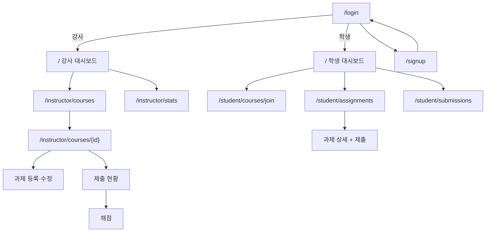

# 화면 설계 (초안)

새 화면을 디자인하지 않고 SB Admin 2 페이지를 복사해 내용만 바꿉니다.
모든 화면은 `layout/layout.html`을 상속합니다 (로그인·회원가입 제외).

## 화면 목록

| 역할 | URL | 화면 | SB Admin 2 원본 |
|------|-----|------|-----------------|
| 공통 | `/login` · `/signup` | 로그인 · 학생 회원가입 | login.html · register.html |
| 공통 | `/` | 역할별 대시보드 | index.html |
| 강사 | `/instructor/courses` · `/{id}` | 강좌 목록 · 상세 | tables.html · cards.html |
| 강사 | `/instructor/assignments/new` · `/{id}/edit` | 과제 등록 · 수정 | forms (카드 + form) |
| 강사 | `/instructor/assignments/{id}/submissions` | 제출 현황 + 미제출자 | tables.html (DataTables) |
| 강사 | `/instructor/submissions/{id}/grade` | 채점 · 피드백 | cards.html + form |
| 강사 | `/instructor/stats` | 통계 대시보드 | charts.html |
| 학생 | `/student/courses/join` | 참여코드 입력 | forms |
| 학생 | `/student/assignments` · `/{id}` | 내 과제 목록 · 상세 + 제출 | tables.html · cards.html |
| 학생 | `/student/submissions` | 내 제출 · 점수 · 피드백 | tables.html |
| 공통 | `/error/403` · `/error/404` | 권한 없음 · 없는 페이지 | 404.html |

## 화면별 구성

### 대시보드 `/`
- **강사**: 카드(내 강좌 수, 진행중 과제 수, 채점 대기 수) + 최근 제출 표
- **학생**: 카드(수강 강좌 수, 제출률, 평균 점수, 마감 임박 수) + 마감 임박 과제 목록

### 강사
- **강좌 목록**: 강좌명, 참여코드, 수강생 수, 과제 수를 DataTables로 표시. 상단에 강좌 개설 폼(카드)
- **강좌 상세**: 참여코드 카드 / 수강생 표 / 과제 표(상태 배지, 제출 수, 수정·삭제 버튼) / 과제 등록 버튼
- **과제 등록 · 수정**: 제목, 내용, 시작·종료일시, 배점, 첨부. 검증 에러는 필드 아래에 표시
- **제출 현황**: 제출자 표(학생, 제출 시각, 상태, 점수, 채점 버튼)와 미제출자 표를 분리
- **채점**: 제출 내용과 첨부 다운로드, 점수·피드백 입력 폼
- **통계**: 제출률(도넛), 과제별 평균 점수(막대), 미제출자 표

### 학생
- **참여코드 입력**: 코드 한 칸과 등록 버튼, 실패 시 에러 메시지
- **내 과제 목록**: 강좌, 제목, 마감일, 상태 배지(예정 · 진행중 · 마감), 제출 여부
- **과제 상세 + 제출**: 과제 정보 카드와 제출 폼. 기간 밖이면 버튼을 비활성화하되 서버에서도 막는다 (B1)
- **내 제출**: 과제, 제출 시각, 상태, 점수, 피드백

## 상태 배지

| 상태 | 조건 | 색 |
|------|------|-----|
| 예정 | 현재 < 시작일시 | 회색 |
| 진행중 | 시작 ≤ 현재 ≤ 종료 | 초록 |
| 마감 | 현재 > 종료일시 | 빨강 |

## 사이드바

| 역할 | 메뉴 |
|------|------|
| 강사 | 대시보드, 강좌 관리, 과제 등록, 통계 대시보드 |
| 학생 | 대시보드, 수강 등록, 내 과제, 내 제출 · 점수 |

## 화면 이동 흐름

